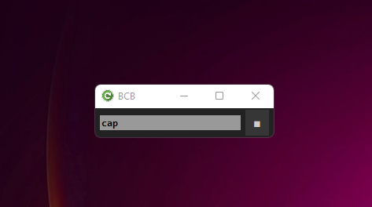
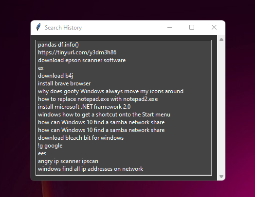
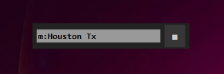

# Browse & Command Bar (for Windows)

This new desktop program for Windows is an incredibly useful tool 
for users who need quick access to system applications, commands, 
and internet queries. Writen in Python it uses little resources. 
This program gives users the ability to launch apps, system commands, 
and internet queries right from the desktop, eliminating the need to 
open a terminal or browser window to access them. The user creates simple 
aliases for any task. The aliases can then be typed into the entry field 
to execute the tasks. So it is easy to use and intuitive, 
providing users with the ability to quickly access information without 
having to navigate through multiple windows. 
DescQ for Linux is a great way to save time and effort while increasing productivity.

---

Some features are: 
* Save URLs and recall them later
* Save text from the clipboard and access later
* Start an Internet search (keeps history)
* Set up searches to use specific services (like: Google Maps)
* Set up commands to launch programs, documents, or URLs

------
## Installing BCB
Python 3.5 or greater must be present on your system. 
>https://www.python.org/downloads/windows/ 

>>[install BCB (setup_BCBW.exe)](setup_BCBW.exe)

>The install will attempt to install 
several modules that may not be included 
in the base python package.

---
## Positioning on the desktop


With the caption on you can position the window. 

To reposition use the _cap_ command to toggle the 
window caption bar on and off. The _winset_ command saves 
the windows geometry and caption status.

 
 
*positioned just above the taskbar* 

To use BCB type into the entry field. 
Below is a list of possibilities. 

| command/text | action/description |
| :----- | :---- |
|_a URL_|saves URL to a list|
|_search text_|starts a search in browser|
|**sc** or _action button_|saves clipboard contents|
|**list**|opens dialog with list of saved URLs|
|**hist**|opens dialog with list of saved search texts|
|**=**_2+2..._|calculator|
|**cap**|toggles window caption bar|
|**winset**|saves window size/position settings|
|**eu**|edit saved URL list (urls.lst)|
|**ec**|edit saved clips text (clips.txt)|
|**eh**|edit saved search history (hist.csv)|
|**es**|edit custom command / services file (serv.txt)|
|**ee**|edit name of your text editor|
|**help**|view BCB help notes|
|**up/down arrow**|recall last 10 entries|
|**u:**_URL.._|opens a url in browser|
|**>**_URL.._|opens a url in browser (use @$>)|
|**>**_...exe_|opens an executable on local system (use @$>)|

---

Use the **_hist_** command to pop up a dialog of your 
saved searches.



## System commands and website directed searches

In _serv.txt_ you can set up custom searches and 
local commands to run programs. 
Type **_es_** to edit _serv.txt_ file. 


The _serv.txt_ file holds your custom commands and links. 
The entries in _serv.txt_ will take one of these forms:
- URL links 
- system commands
- website directed searches

### serv.txt - Links and system commands 
 Requests can be either URLs (links) or system commands. 
  
 The general format for aliased commands and links is:
 
 **_command-you-will-type, {URL | fullpath-command-line_}** 
 
 **Examples:**
 
 ```bash
   git,https://github.com 
   dev, c:\batch\dev.cmd
   shutdown, shutdown -s -t 000
   reboot, shutdown -r -t 000
   drive, https://drive.google.com
 ```
 
 To perform these commands in BCB you would type in 
 the command and hit Enter or click the action button. 
 
 **For the above examples:**
 
 | **command** | resulting action |
 | :---------- | :-------------------- |
 |_git_|opens github.com in your browser| 
 |_dev_|executes your shell script to ... ?| 
 |_shut_|shuts down your machine| 
 |_shutdo_|shuts down your machine| 
 |_sh_|shuts down your machine| 
 |_reboot_|reboots your machine|
 |_reb_|reboots your machine|
 
 Create your commands in "serv.txt" 
 in assending order which will allow for unique substrings 
 as your commands become familiar from use. 
 
## Website directed searches
 These must be URLs with a _?querystring_. 
 The first character of each line must begin with 
 a single letter (a-z, 0-9).
 
 The general format is:
 
 >
 **letter, name, website-URL + query-string...** 
 where letter is a unique letter a-z, A-Z, 0-9
 
 _**You may have to experiment with each website to learn 
 how it formats their search querystring.**_ 
 
 #### examples for the serv.txt file: 
 
 ```bash
 a, Amazon, https://smile.amazon.com/s/ref=nb_sb_noss_1?field-keywords=
 
 i,Google Images,http://images.google.com/images?q= 
 
 p, Php,http://php.net/manual-lookup.php?pattern= 
 
 m, Google Maps, https://www.google.com/maps/search/
 
 ```
 
 #### Use like this: 
>
 a:mini computers 
 i:wallpaper for Linux Mint 
 p:preg_split 
 
 
 
Note: the ":" is required when requesting the site-directed search. 
It may take a little work to discover some of these querystrings but there are many. 

## Save and recall URLs and text clippings.

To save a URL copy or type it into BCB and hit Enter. 
The URL to save must begin with _http_. 
To view and re-open saved URLs type **list** into BCB and hit Enter. 

To save text from your system clipboard type **sc**, 
or click the action button with the entry field empty. 
The text is appended to the _clip.txt_ file. 
If a URL is in the clipboard it will be saved to 
the _urls.txt_ file and not the _clip.txt_.

To view/edit text you've saved just type **ec** Enter. 
Your text editor will pop-up with all of your clips.

## Specify the text editor
Before you start using BCB edit the _edit.txt_ one line file 
putting in the name to start your text editor. 
The **ee** command will open this file with the editor 
you've specified. The default is _notepad.exe_.


#### List of BCB System Files

| | |
| ----- | ----- |
|_clip.txt_|text file of clippings|
|_bcb.py_|BCB main source|
|_hist.txt_|text file of search history|
|_serv.txt_|text file of $ commands and special querys|
|_coor.txt_|window geometry ...|
|_edit.txt_|name of your text editor program|
|_urls.txt_|text file of saved URLs|
|_seaq.txt_|querystring to search with you favorite search engine|
|_help.txt_|text file of help notes|


#### end

 